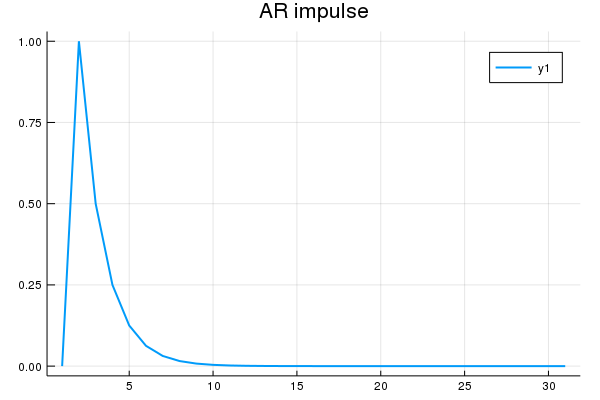
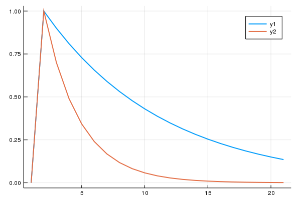
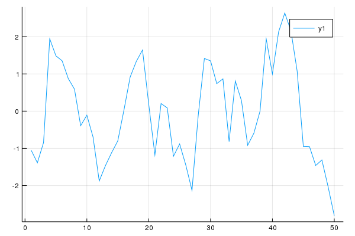
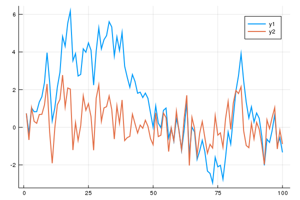

```julia
function arimpulse1(nn,rho_y, chok)
    # AR(1) example
    # David Florian-Hoyle Jan-2011
    #
    # Compare impulse response for AR(1) process
    #
    # function [YY]=arimpulse1(nn,rho_y, chok)
    #
    # nn   #Number of periods for the IRF
    # rho_y    #Autoregresive coefficient
    # chok     #choque aplicado sobre a série
    ##
    #Defining the Shock
    eps_irf = zeros(Int, nn+1,1);
    eps_irf[2,1] = chok;
    #Initial codition
    y_0 = 0;
    y = y_0;

    # Vector that save the IRF
    YY = zeros(Float16,nn+1,1);

    # Loop that computes the IRF for the AR(1) process
    for j = 1:nn+1
        y = rho_y*y + eps_irf[j,1];
        YY[j,1] = y;
    end

        return YY
end

```


    arimpulse1 (generic function with 1 method)


```julia
  using Plots
  gr(fmt = "png")


  IX = arimpulse1(30,.5, 1);
  plot(IX,linewidth=2,title="AR impulse")
```





```julia
function arimpulse2(nn,rho_z,rho_y, chok)
    # AR(1) example
    # David Florian-Hoyle Jan-2011
    #
    # Compare impulse response for AR(1) process
    #
    # function [ZZ,YY]=arimpulse(nn,rho_z,rho_y, chok)
    #
    # nn    #Number of periods for the IRF
    # rho_z    #Autoregresive coefficient
    # rho_y   #Autoregresive coefficient
    # chok     #choque aplicado sobre a série
    ##
    #Defining the Shock
    eps_irf = zeros(nn+1,1)
    eps_irf[2,1] = chok

    #Initial codition
    z_0 = 0.0;
    z = z_0;

    # Vector that save the IRF
    ZZ = zeros(nn+1,1);

    # Loop that computes the IRF for the AR(1) process
    for j = 1:nn+1
        z = rho_z*z + eps_irf[j];
        ZZ[j,1] = z;
    end


    #Initial codition
    y_0 = 0.0;
    y = y_0;

    # Vector that save the IRF
    YY = zeros(nn+1,1);

    # Loop that computes the IRF for the AR(1) process
    for j = 1:nn+1;
        y = rho_y*y + eps_irf[j];
        YY[j,1] = y;
    end
    ZY = [ZZ YY]
    return ZY
end

```


    arimpulse2 (generic function with 1 method)


```julia
IX = arimpulse2(20,.90,.7, 1)
plot( IX, linewidth=2)
```





```julia
function ASarsimule(nn,rho_x )
    # AR(1) example
    # David Florian-Hoyle Jan-2011
    #
    #compare simalation of AR(1) process
    #
    #[XX] = arsimule(nn,rho_x )
    #nn = 250;           # Number of periods to be simulated
    #rho_x = 0.9;        # Autoregresive coeficcient for the AR(1) process
    ##
     #nn=50
     #rho_x=.05
    eps = randn(nn);  # White noise

    x_0 = 0.0;
    x = x_0;

    # Vector that save each simulation
    XX = zeros(nn);

    # Loop that simulates the AR(1) process
    for j in 1:nn
        x = rho_x*x + eps[j];
        XX[j,1] = x;
    end
      return XX
end


```


    ASarsimule (generic function with 1 method)


```julia

YX= ASarsimule(50,.8)
plot(YX)

```





```julia
function ASarsimule2(nn,rho_x ,rho_y )
    # AR(1) example
    # David Florian-Hoyle Jan-2011
    #
    #compare simalation of AR(1) process
    #
    #[XX] = arsimule(nn,rho_y,rho_x )
    #nn = 250;           # Number of periods to be simulated
    #rho_y = 0.1;        # Autoregresive coeficcient for the AR(1) process
    #rho_x = 0.9;        # Autoregresive coeficcient for the AR(1) process
    ##
    #nn = 20
    #rho_y = .9
    #rho_x = .7
    eps = randn(nn,1);  # White noise

    #Initial condition
    y_0 = 0;
    y = y_0;

    # Vector that save each simulation
    YY = zeros(nn,1);

    # Loop that simulates the AR(1) process
    for j = 1:nn
        y = rho_y*y + eps[j];
        YY[j,1] = y;
    end

    #Initial codition
    x_0 = 0.0;
    x = x_0;

    # Vector that save each simulation
    XX = zeros(nn,1);

    # Loop that simulates the AR(1) process
    for j = 1:nn
        x = rho_x*x + eps[j];
        XX[j,1] = x;
    end
    NXY = [XX YY]
    return NXY
end


```


    ASarsimule2 (generic function with 1 method)


```julia
IX = [ASarsimule2(100,.9,.4) ]
plot( IX, linewidth=2)
```





```julia

```
